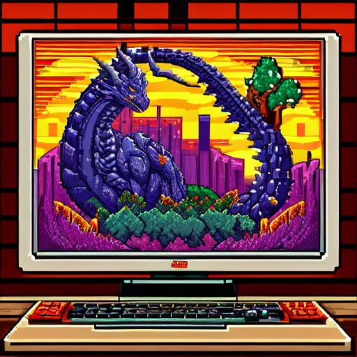

# CloserPlayerTRPG

<div align="center">




</div>

# Introduction 🐉
This project aims to reduce the feeling of remoteness for people playing hybrid TRPGs online (some players in person and one online for now).
The basic idea is giving the remote player the opportunity to easily interact with the environment during the session.

The idea is to use a `client-server` application to remotely control a rotating platform, where a portable computer or tablet can be placed to display the remote player. 
The remote player can control the rotating platform from their computer. 
This concept is based on using a video-call communication app like Discord. 
In this way, the remote player can look around and interact more effectively with other players.

# The basic architecture 🏗️
The server, placed on top of the rotating platform, will interact with an Arduino. This Arduino will control the platform's rotation. A more detailed explanation and guide will be available.
The client will be used by the remote player and will be used to control the rotating platform.

# Software 💿

## Installation of Requirements 🔧
* Install Anaconda.
* Navigate in the utils folder.
* Run the following command: 
```bash
conda env create --file environment.yml --name CloserPlayerTRPG
```
* At the end of the installation activate the environment:
```bash
conda activate CloserPlayerTRPG
```

# Use the framework 📙
To use the framework, you can run the file directly from the console or generate an .exe file and run the generated executable.
## Run from console ⌨️
* Navigate in the `app` folder.
### Client 🖥️
* Run:
```bash
python client.py
```
### Server 🌐
* Run:
```bash
python server.py
```

## Exporting app for Windows
### Client 🖥️
* Navigate in the `app` folder.
* Run the following command:
```bash
pyinstaller --onefile --windowed client.py
```
* In the dist folder you can find the exe file of the client.

### Server 🌐
* Navigate in the `app` folder.
* Run the following command:
```bash
pyinstaller --onefile --windowed server.py
```
* In the dist folder you can find the exe file of the server.

# User Guide 📜

## Client 🖥️
* After opening the client you have to enter the Ip address and the port of the server.
* Click `Connect`.
* Once connected, the window will resize to a small frame where the selected input will be displayed.
* To send input, you must select the window first. If other applications are selected, the client will not detect the input.

## Server 🌐
* After opening the server you can enter the Ip address and the port, for example `127.0.0.1:5556`.
* Select `Start Server`.
* Wait for the client to connect.

## Router port ❌
To avoid opening router ports, use app like Tailscale or Hamachi.

# Hardware 🛠️
Guide coming soon.

## Issues 🆘
Nothing for now

# To do 📝
* Link arduino to the rotatin platform
* 3d print a structure for vertical rotation
* Provide a guide for the Hardware aspect of the project

# Future Ideas 💡
* Provide the remote player with the opportunity to physically roll a die using a robotic hand.
* Create "dances" that the platform can perform to allow the player to celebrate after a funny situation.

# License 🛂
This project is licensed under the **GNU General Public License v3.0**. You are free to use, modify, and distribute this code under the following conditions:

1. **Attribution**: If you use this code as a base for your project or create derivative works, please give appropriate credit by including my name (Ivan De Cosmis) in your project documentation, README, or other relevant materials.

2. **Share-Alike**: Any derivative work you create based on this project must also be licensed under the GPLv3. This ensures that future users can benefit from your modifications as well.

3. **Commercial Use**: If you intend to use this project or any derivatives for commercial purposes, please reach out to me first to discuss proper attribution and any potential agreements.

For more details, please refer to the full text of the **GNU General Public License v3.0** [here](https://www.gnu.org/licenses/gpl-3.0.html).