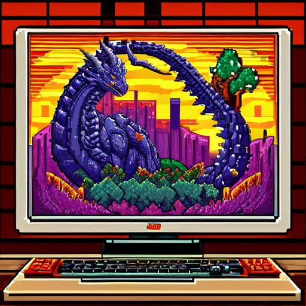

# CloserPlayerTRPG

# Introduction 🐉
This project aims to reduce the feeling of remoteness for people playing hybrid TRPGs online (some players in person and one online for now).
The basic idea is giving the remote player the opportunity to easily interact with the environment during the session.

The idea is to use a `client-server` application to remotely control a rotating platform, where a portable computer or tablet can be placed to display the remote player. 
The remote player can control the rotating platform from their computer. 
This concept is based on using a video-call communication app like Discord. 
This way, the remote player can look around and interact more effectively with others, while the in-person players can see his face throughout the session.

# Introduzione 🐉
Questo progetto mira a ridurre la sensazione di lontananza per le persone che giocano a TRPG ibridi online (con alcuni giocatori in presenza e uno online per ora).

L'idea di base è offrire al giocatore remoto la possibilità di interagire facilmente con l'ambiente durante la sessione.

L'idea è utilizzare un'applicazione client-server per controllare a distanza una piattaforma rotante, su cui può essere posizionato un computer portatile o un tablet per mostrare il giocatore remoto. Il giocatore remoto può controllare la piattaforma rotante dal proprio computer. Questo concetto si basa sull'uso di un'app di comunicazione video come Discord. In questo modo, il giocatore remoto può guardarsi intorno e interagire in modo più efficace con gli altri, mentre i giocatori in presenza possono vedere il suo volto per tutta la durata della sessione.

- [English version](guide/en/README.md)
- [Versione italiana](guide/it/README.md)