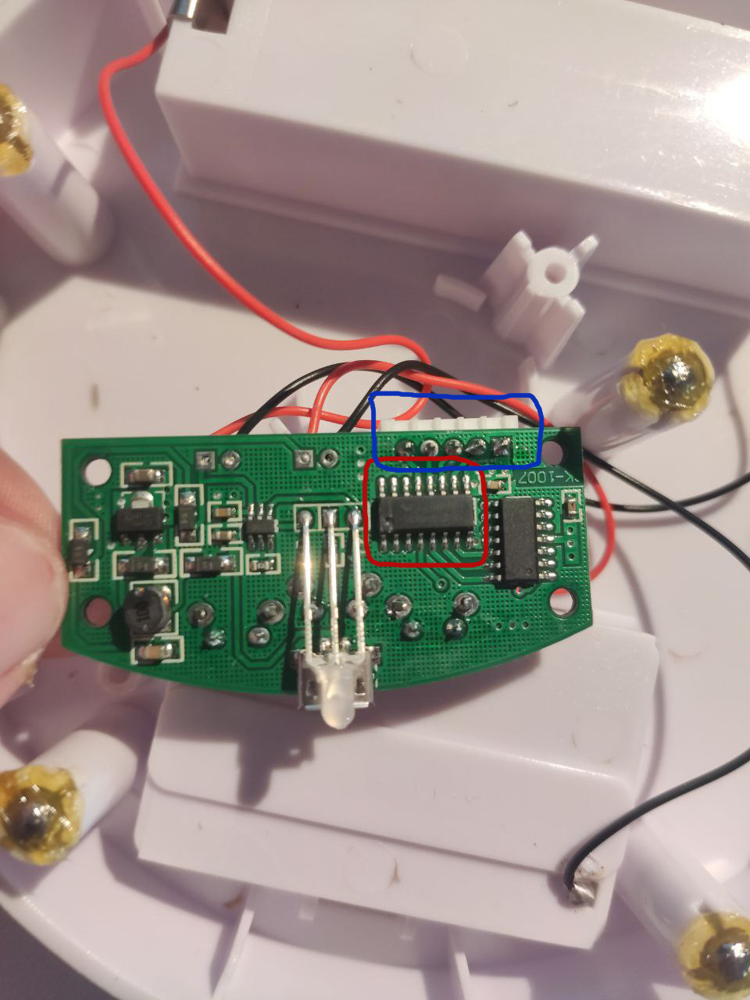
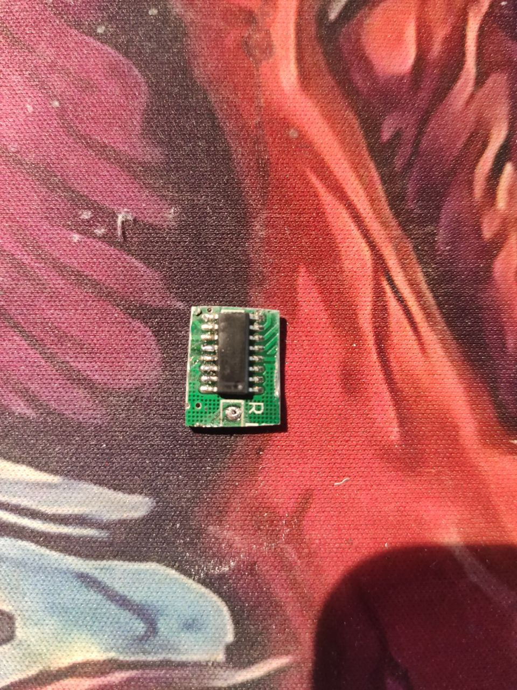
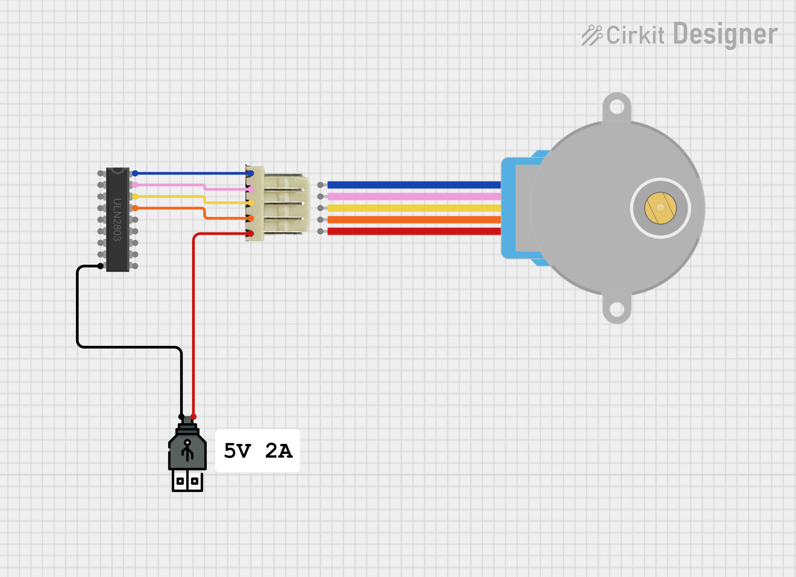
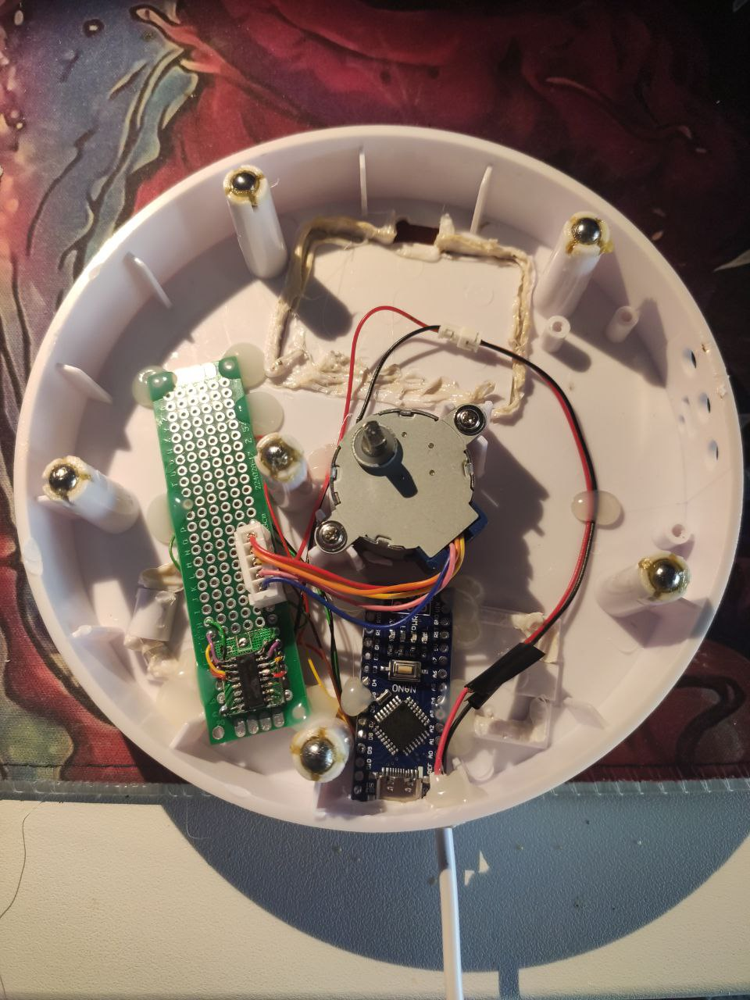
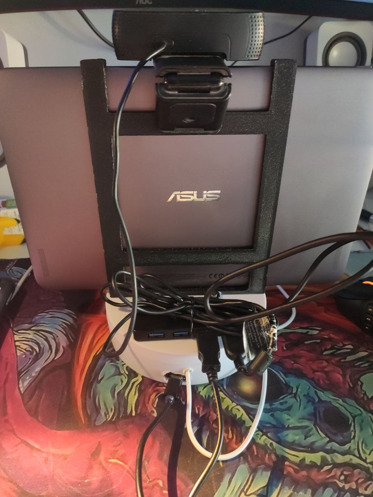
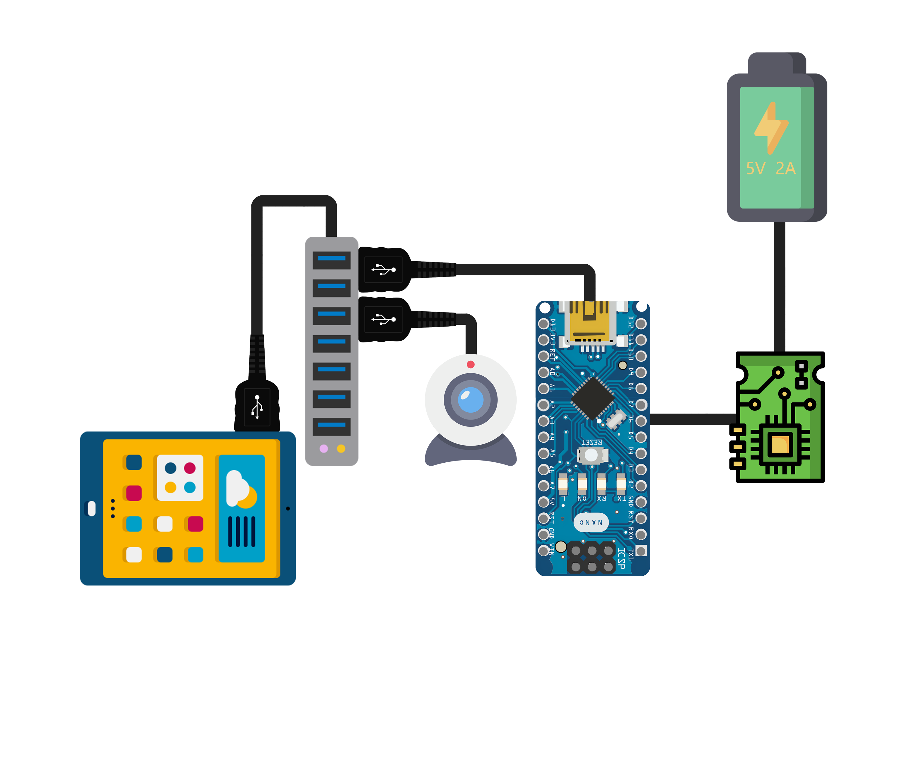

# CloserPlayerTRPG

<div align="center">


</div>

# Introduction 🐉
This project aims to reduce the feeling of remoteness for people playing hybrid TRPGs online (some players in person and one online for now).
The basic idea is giving the remote player the opportunity to easily interact with the environment during the session.

The idea is to use a `client-server` application to remotely control a rotating platform, where a portable computer or tablet can be placed to display the remote player. 
The remote player can control the rotating platform from their computer. 
This concept is based on using a video-call communication app like Discord. 
This way, the remote player can look around and interact more effectively with others, while the in-person players can see his face throughout the session.

# The basic architecture 🏗️
The server, placed on top of the rotating platform, will interact with an Arduino. This Arduino will control the platform's rotation.
The client will be used by the remote player to control the rotating platform.

# Software 💿

## Installation of Requirements 🔧
* Install Anaconda.
* Navigate in the `other/utils` folder.
* Run the following command: 
```bash
conda env create --file environment.yml --name CloserPlayerTRPG
```
* At the end of the installation activate the environment:
```bash
conda activate CloserPlayerTRPG
```

# Use the framework 📙
To use the framework, you can run the file directly from the console or generate an .exe file and run the generated executable.
## Run from console ⌨️
* Navigate in the `app` folder.
### Client 🖥️
* Run:
```bash
python client.py
```
### Server 🌐
* Run:
```bash
python server.py
```

## Exporting app for Windows
### Client 🖥️
* Navigate in the `app` folder.
* Run the following command:
```bash
pyinstaller --onefile --windowed client.py
```
* In the dist folder you can find the exe file of the client.

### Server 🌐
* Navigate in the `app` folder.
* Run the following command:
```bash
pyinstaller --onefile --windowed server.py
```
* In the dist folder you can find the exe file of the server.

# Hardware  🛠️
## Components used: 🎟️
* [Mcbazel - 360° Rotating Stand](https://www.amazon.it/dp/B09FZ36N3M?ref=ppx_yo2ov_dt_b_fed_asin_title).
* [Arduino Nano Clone](https://www.amazon.it/dp/B0CWH4P152?ref=ppx_yo2ov_dt_b_fed_asin_title).
* [Breadboard](https://www.amazon.it/dp/B078HV79XX?ref=ppx_yo2ov_dt_b_fed_asin_title).

## Steps 📋
### Adapting the Rotating Stand
* Remove the top lid:


* Unplug the motor from the motherboard.
* Remove the motor and motherboard from the case, and cut the wires connected to the battery holders:

* Cut the battery holders to create more space inside the case. I used my soldering iron for this:


### Remove the useful components from the motherboard

* Cut the ULN2003 component and desolder the motor connector:



* Use double-sided tape to attach the removed component to the breadboard:


* Use a soldering iron to connect the ULN2003 to the motor connector, referring to the following schematic for guidance:



* Use a soldering iron to connect the Arduino Nano to the ULN2003, referring to the following schemaric for guidance:


* I inserted the components as shown in the image, using hot glue to fix them in place and using a male/female connector to be able to disconnect the 5V USB power supply if necessary:


### 3D print a tablet holder (optional)
* You can also use a portable PC, but for practical reasons, I chose to use a tablet. Therefore, I needed a structure to hold it.
The following models are available:
    * [Structure to hold the tablet](other/3D%20pieces/Structure.stl)
    * [Bolt holes](other/3D%20pieces/BoltHole.stl)

I've fused the two pieces togheter using a cyanoalicrate based glue.

* Results:


* Using the iron solder I punctured the plate and with 4 bolts I connected the two pieces:


### Final result
* Slide the tablet in the frame.
* I have used an externa webcam with integrated mic, I have also used a usb-c hub to connet the cam and arduino to the tablet as show in the figures:


This general schema represent the final result:


# User Guide 📜
## Server 🌐
* Open the server.
* Insert the Ip Address and the port where to host the server, e.g. `127.0.0.1:5556`.
* Select in the top right the comunication port for arduino.
* Click `Start Server`.
* Wait for the client to connect.

## Client 🖥️
* Open the client.
* Insert the Ip Address and the port, e.g. `127.0.0.1:5556`.
* Click `Connect`.
* Once connected, the window will resize to a small frame where the selected input will be displayed.
* To send input, you must select the window first. If other applications are selected, the client will not detect the input.


## Router port ❌
To avoid opening router ports, use app like Tailscale or Hamachi.

### Example with Hamachi
* On the server pc:
    * Open Hamachi 
    * Create a new network, e.g. `CloserTest`:
    
    
    * Open the server application
    * Insert the highlighted Ip from your Hamachi and a port of your choise, e.g. `5556`.
    * Select on the top right the comunication port of the connected arduino:
    
    * Click `Start Server`
* On the client pc:
    * Open Hamachi.
    * Join the created network.
    * Open the client application.
    * Insert the Ip of the server pc and the port you choose during the server start (In this example `127.0.0.1:5556`).
    * Click `Connect`.
    

Now you can control the rotation of the arduino connected to the server with the client.
Using a voice chat app (like Discord), your friend playing remotely can move the tablet and look around, while everyone playing in person can see his face as he looks around!

# Issues 🆘
Nothing for now

# Future Ideas 💡
* Provide the remote player with the opportunity to physically roll a die using a robotic hand.
* Create "dances" that the platform can perform to allow the player to celebrate after a funny situation.
* 3d print a structure for vertical rotation.


# License 🛂
This project is licensed under the **GNU General Public License v3.0**. You are free to use, modify, and distribute this code under the following conditions:

1. **Attribution**: If you use this code as a base for your project or create derivative works, please give appropriate credit by including my name (Ivan De Cosmis) in your project documentation, README, or other relevant materials.

2. **Share-Alike**: Any derivative work you create based on this project must also be licensed under the GPLv3. This ensures that future users can benefit from your modifications as well.

3. **Commercial Use**: If you intend to use this project or any derivatives for commercial purposes, please reach out to me first to discuss proper attribution and any potential agreements.

For more details, please refer to the full text of the **GNU General Public License v3.0** [here](https://www.gnu.org/licenses/gpl-3.0.html).