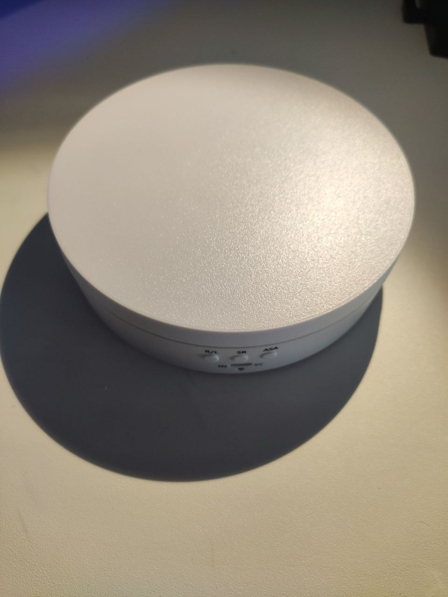

# L'architettura di base 🏗️
Il server, posizionato sopra la piattaforma rotante, interagirà con un Arduino. Questo Arduino controllerà la rotazione della piattaforma.  
Il client sarà utilizzato dal giocatore remoto per controllare la piattaforma rotante.

# Software 💿

## Installazione dei requisiti 🔧
* Installa Anaconda.
* Vai nella cartella `other/utils`.
* Esegui il seguente comando:
```bash
conda env create --file environment.yml --name CloserPlayerTRPG
```
* Alla fine dell'installazione, attiva l'ambiente:
```bash
conda activate CloserPlayerTRPG
```

# Utilizzo del framework 📙
Per usare il framework, puoi eseguire il file direttamente dalla console o generare un file .exe ed eseguire l'eseguibile generato.
## Esecuzione da console ⌨️
* Vai nella cartella `app`.
### Client 🖥️
* Vai nella cartella `client`.
* Esegui:
```bash
python client.py
```
### Server 🌐
* Vai nella cartella `server`.
* Esegui:
```bash
python server.py
```

## Esportare l'app per Windows
### Client 🖥️
* Vai nella cartella `app/client`.
* Esegui il seguente comando:
```bash
pyinstaller --onefile --windowed client.py
```
* Nella cartella dist troverai il file exe del client.

### Server 🌐
* Vai nella cartella `app/server`.
* Esegui il seguente comando:
```bash
pyinstaller --onefile --windowed server.py
```
* Nella cartella dist troverai il file exe del server.

# Hardware 🛠️
## Componenti utilizzati 🎟️
* [Mcbazel - Supporto rotante a 360°](https://www.amazon.it/dp/B09FZ36N3M?ref=ppx_yo2ov_dt_b_fed_asin_title).
* [Arduino Nano Clone](https://www.amazon.it/dp/B0CWH4P152?ref=ppx_yo2ov_dt_b_fed_asin_title).
* [Breadboard](https://www.amazon.it/dp/B078HV79XX?ref=ppx_yo2ov_dt_b_fed_asin_title).

## Passaggi 📋
### Adattamento del supporto rotante
* Rimuovi il coperchio superiore:



* Scollega il motore dalla scheda madre.
* Rimuovi il motore e la scheda madre dalla custodia e taglia i fili collegati ai porta batterie:

* Taglia i porta batterie per creare più spazio all'interno della custodia. Ho usato il mio saldatore per questo:


### Rimuovere i componenti utili dalla scheda madre

* Taglia il componente ULN2003 e dissalda il connettore del motore:


* Usa del nastro biadesivo per fissare il componente rimosso sulla breadboard:


* Usa un saldatore per collegare l'ULN2003 al connettore del motore, facendo riferimento allo schema seguente per orientarti:


* Usa un saldatore per collegare l'Arduino Nano all'ULN2003, facendo riferimento allo schema seguente:


* Ho inserito i componenti come mostrato nell'immagine, utilizzando colla a caldo per fissarli e un connettore maschio/femmina per poter scollegare l'alimentatore USB da 5V se necessario:


### Stampa 3D di un supporto per tablet (opzionale)
* Puoi anche usare un PC portatile, ma per motivi pratici ho scelto di usare un tablet. Di conseguenza, avevo bisogno di una struttura per sorreggerlo.  
I seguenti modelli sono disponibili:
    * [Struttura per sorreggere il tablet](../../other/3D%20pieces/Structure.stl)
    * [Fori per le viti](../../other/3D%20pieces/BoltHole.stl)

Ho unito i due pezzi usando una colla a base di cianoacrilato.

* Risultati:


* Usando il saldatore, ho forato la piastra e con 4 viti ho collegato i due pezzi:


### Risultato finale
* Inserisci il tablet nel supporto.
* Ho usato una webcam esterna con microfono integrato e un hub USB-C, incollato con la colla a caldo sul retro del piano, per collegare la webcam e l'Arduino al tablet, come mostrato nelle immagini:

  
Questo schema generale rappresenta il risultato finale:


### Miglioramenti 📈
Questi miglioramenti sono opzionali, ma consentono una migliore gestione dei cavi e praticità:
* Ho stampato in 3D una [piccola scatola](../../other/3D%20pieces/box.3mf) per conservare tutti i cavi all'interno.


* Ll mio tablet non riesce a stare acceso per tutta la durata di una sessione, quindi ha bisogno di essere caricato. Per non aggiungere altri cavi ho deciso di cambiare l'alimentazione in 12V 2A e utilizzare uno step down a 5V 5A e poter alimentare sia il 28byj-48 che il tablet.
* Circuito generale aggiornato:


# Guida utente 📜
## Server 🌐
* Apri il server.
* Inserisci l'indirizzo IP e la porta su cui ospitare il server, es. `127.0.0.1:5556`.
* Seleziona in alto a destra la porta di comunicazione per Arduino.
* Clicca su `Start Server`.
* Attendi che il client si connetta.

## Client 🖥️
* Apri il client.
* Inserisci l'indirizzo IP e la porta, es. `127.0.0.1:5556`.
* Clicca su `Connect`.
* Una volta connesso, la finestra si ridimensionerà a un piccolo frame in cui verrà visualizzato l'input selezionato.
* Per inviare input, devi prima selezionare la finestra. Se sono selezionate altre applicazioni, il client non rileverà l'input.

## Porta del router ❌
Per evitare di aprire le porte del router, usa app come Tailscale o Hamachi.

### Esempio con Hamachi
* Sul PC server:
    * Apri Hamachi.
    * Crea una nuova rete, es. `CloserTest`:
    

    * Apri l'applicazione server.
    * Inserisci l'IP evidenziato da Hamachi e una porta a tua scelta, es. `5556`.
    * Seleziona in alto a destra la porta di comunicazione di Arduino collegato:
    
    
    * Clicca su `Start Server`.
* Sul PC client:
    * Apri Hamachi.
    * Unisciti alla rete creata.
    * Apri l'applicazione client.
    * Inserisci l'IP del PC server e la porta scelta durante l'avvio del server (in questo esempio `127.0.0.1:5556`).
    * Clicca su `Connect`.
    

Ora puoi controllare la rotazione dell'Arduino collegato al server con il client. Utilizzando un'app di chat vocale (come Discord), il tuo amico che gioca da remoto può muovere il tablet e guardarsi intorno, mentre tutti i giocatori in presenza possono vedere il suo volto mentre si guarda attorno!

# Problemi 🆘
Nessuno per ora.

# Idee future 💡
* Fornire al giocatore remoto la possibilità di lanciare fisicamente un dado usando una mano robotica.
* Creare "danze" che la piattaforma può eseguire per permettere al giocatore di festeggiare dopo una situazione divertente.
* Stampare in 3D una struttura per la rotazione verticale.

# Licenza 🛂
Questo progetto è concesso sotto licenza **GNU General Public License v3.0**. Sei libero di usare, modificare e distribuire questo codice alle seguenti condizioni:

1. **Attribuzione**: Se usi questo codice come base per il tuo progetto o crei opere derivate, ti preghiamo di dare credito appropriato includ

endo il mio nome (Ivan De Cosmis) nella documentazione del tuo progetto, README o altri materiali rilevanti.

2. **Condivisione allo stesso modo**: Qualsiasi lavoro derivato che crei basato su questo progetto deve essere concesso in licenza sotto GPLv3. Questo assicura che gli utenti futuri possano beneficiare delle tue modifiche.

3. **Uso commerciale**: Se intendi usare questo progetto o qualsiasi derivato per scopi commerciali, contattami prima per discutere la corretta attribuzione e eventuali accordi.

Per maggiori dettagli, consulta il testo completo della **GNU General Public License v3.0** [qui](https://www.gnu.org/licenses/gpl-3.0.html).